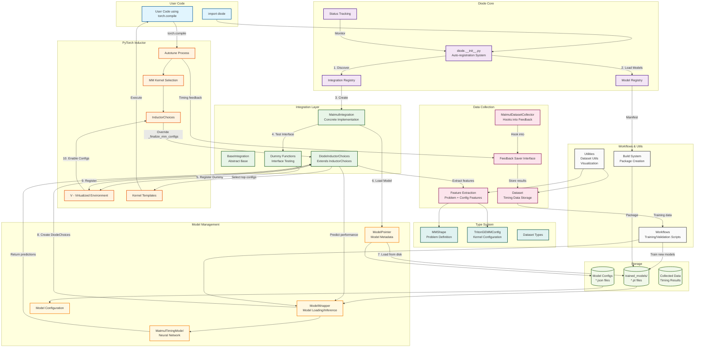

# Torch-Diode Systems Architecture

This diagram shows how the torch-diode system components interact with PyTorch Inductor to provide ML-based kernel selection.

## Key Architecture Components

### 1. **Auto-registration System** (Main Entry Point)
- `diode.__init__.py` orchestrates the entire integration process
- Discovers available integrations automatically
- Tests PyTorch interfaces with dummy functions
- Loads actual models only when interfaces are available
- Enables relevant PyTorch configurations

### 2. **Integration Layer** (PyTorch Interface)
- `BaseIntegration`: Abstract framework for all integrations
- `MatmulIntegration`: Specific implementation for matrix multiplication
- `DiodeInductorChoices`: Extends PyTorch's InductorChoices to inject ML predictions
- Seamlessly overrides `_finalize_mm_configs` method

### 3. **Model Management System**
- `ModelPointer`: Metadata and path management for trained models
- `ModelWrapper`: Loads, compiles, and runs inference on trained models
- `ModelRegistry`: Centralized registry of all available models
- Supports multiple model formats and configurations

### 4. **Data Collection Pipeline**
- `MatmulDatasetCollector`: Hooks into PyTorch's feedback system
- Collects timing data during autotune processes
- Extracts features from problem shapes and kernel configurations
- Stores structured datasets for model training

### 5. **Type System**
- `MMShape`: Represents matrix multiplication problem characteristics
- `TritonGEMMConfig`: Represents kernel configuration parameters
- Strong typing ensures data consistency across the system

### 6. **Inductor Integration Flow**
1. User imports diode → auto-registration begins
2. System tests PyTorch interfaces with dummy functions
3. Loads trained models from disk if interfaces are available
4. Registers `DiodeInductorChoices` as the active choice handler
5. During `torch.compile`, the system intercepts kernel selection
6. Extracts features from the problem and available configurations
7. Runs ML model inference to predict kernel performance
8. Returns top-k configurations based on predictions

### 7. **Data Flow**
- **Training Time**: Collector gathers timing data → Workflows train models → Models stored to disk
- **Inference Time**: Models loaded → Features extracted → Predictions made → Best kernels selected

This architecture allows torch-diode to seamlessly integrate with PyTorch's compilation pipeline while maintaining modularity and extensibility for future optimization targets beyond matrix multiplication.
